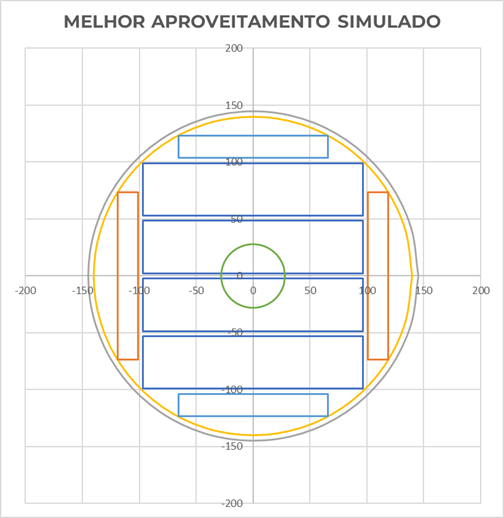

# Simulador de Planos de Corte para Serraria

## 📖 Descrição

Este projeto é uma ferramenta desenvolvida em **VBA para Excel** que simula e otimiza planos de corte de toras de madeira em taboados. Dada a complexidade geométrica e o grande número de variáveis — como diâmetro da tora, espessuras de produtos e de serras — este simulador automatiza a geração e avaliação de múltiplos cenários para maximizar o aproveitamento volumétrico da matéria-prima.

A ferramenta foi projetada para resolver desafios comuns em serrarias, como a dificuldade em validar a geometria do corte, comparar combinações de forma rápida e evitar desperdícios.

## 🎯 Objetivo do Projeto

Desenvolver um simulador automatizado que:
- Gera múltiplos planos de corte com base em parâmetros configuráveis.
- Valida a geometria de cada plano, garantindo sua viabilidade física.
- Calcula o volume dos produtos gerados (tábuas, costaneiras, etc.).
- Determina o aproveitamento volumétrico (%) de cada plano de corte.
- Exporta os resultados para análise e tomada de decisão estratégica.

## ✨ Funcionalidades Principais

- **Simulação Parametrizada:** O usuário define todas as variáveis de entrada em uma planilha dedicada.
- **Cálculo Geométrico:** Utiliza trigonometria para determinar as dimensões máximas dos produtos dentro do diâmetro da tora.
- **Geração Automática de Resultados:** Cria uma nova planilha para cada simulação com um timestamp, armazenando todos os dados de forma organizada.
- **Visualização Gráfica:** Alimenta uma base de dados que gera um gráfico de dispersão em Excel, permitindo visualizar cada plano de corte de forma intuitiva.
- **Otimização de Desempenho:** O código VBA é otimizado para processar milhares de combinações em segundos, desabilitando atualizações de tela e cálculos automáticos durante a execução.

## 🏗️ Estrutura do Projeto

O projeto é composto pelos seguintes componentes no arquivo Excel:

| Componente | Função |
| :--- | :--- |
| **Módulo VBA** | Contém o código principal (`Sub CalcularValores_Otimizado`) que executa a simulação. |
| **Planilha `DADOS DE ENTRADA`** | Interface onde o usuário configura os parâmetros da tora, produtos e serras. |
| **Planilha `Base visualização`** | Armazena dados complementares de cada plano gerado para alimentar os gráficos. |
| **Planilha `RESULTADOS_xxx`** | Criada automaticamente a cada simulação para armazenar os resultados detalhados. |

## 🚀 Como Usar

1. **Abra o arquivo Excel** e navegue até a planilha `DADOS DE ENTRADA`.
2. **Preencha os parâmetros** de entrada, como diâmetro da tora, comprimento, espessuras das serras e as dimensões desejadas para os taboados.
3. **Execute a macro** `CalcularValores_Otimizado` (através de um botão na planilha ou do menu de desenvolvedor).
4. **Aguarde a conclusão**. Uma mensagem informará o fim do processo.
5. **Analise os resultados** na nova planilha `RESULTADOS_YYYYMMDD_HHMMSS` e explore as visualizações na aba `Base visualização`.

## 💻 Tecnologias Utilizadas

- **Microsoft Excel**
- **Visual Basic for Applications (VBA)**

## ⚖️ Licença

Este projeto é distribuído sob a licença MIT. Veja o arquivo `LICENSE` para mais detalhes.
